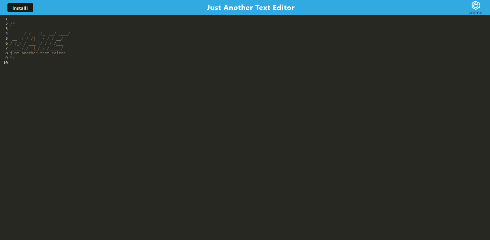

# JATEProgressiveWebApp

  
  
## Description
This is the 19th challenge for the UW Coding bootcamp. For this challenge, we had to follow acceptance criteria to create a simple browser text editor that follows PWA best practices to make the application packagable, and installable.

This application was derived from starter code and utilizes a numerous amount of packages and tools such as `idb`, `workbox`, `wepback`, `babel`, and many more

## Table of Contents
* [Description](#description)
* [Usage](#usage)
* [Questions](#questions)
  
  
## Usage
Below is a screenshot of the deployed application.

You can view the deployed application [here]()
  
## Questions
Any Questions? Please reachout to me at jkasahara2063@gmail.com
In addition, you can view this project and others on my [GitHub](https://github.com/CodeJeffK)
